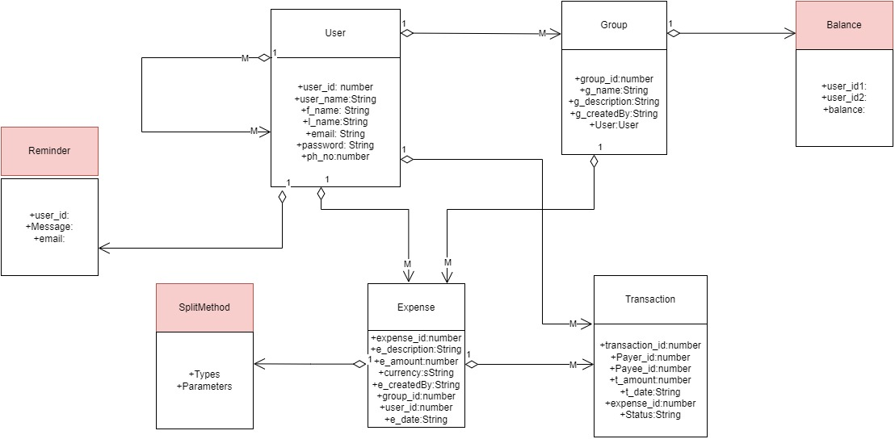

# CentWise

## Description:

CentWise is a collaborative expense tracking and bill-splitting application, designed to simplify financial interactions among friends, roommates, or colleagues. It helps users keep track of shared expenses and settle debts effortlessly.

## Key Features:

* Expense Tracking: Easily log and categorize shared expenses.
* Real-time Balances: Keep track of who owes money and who is owed in real-time.
* Bill Splitting: Automatically calculate and distribute costs among group members.
* Multi-Currency Support: Manage expenses in different currencies for international groups.
* Receipts and Notes: Attach receipts and add notes to transactions for clarity.
* Settlements: Simplify debt settlements with clear, itemized records.

## CentWise - Object Model Diagram

# Steps to setup VS code for the Developers
 
* npm init
* npm i -s express mongoose cors debug
* npm install -D prettier@2.7.1
* npm install -D eslint@8.24.0 eslint-config-prettier@8.50
* npm install -D vite@3.1.4 @vitejs/plugin-react@2.1.0
* npm install react@18.2.0 react-dom@18.2.0